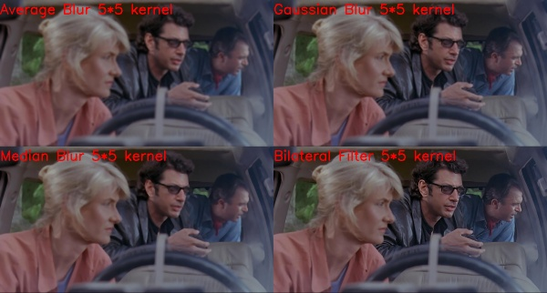
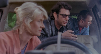
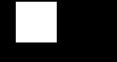
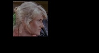
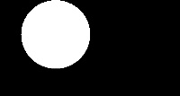
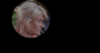
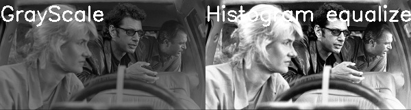

## Sample code from my goofing around with openCv.

### Experiments

### Heuristics
1. Arithmetic using the cv2.add and cv2.subtract methods ensure that the values stay in the range of [0 255] and do not wrap around that range.
2. When creating blank images(e.g. using np.zeros()) always ensure the dtype is "uint8" so the value is constrained to the range [0 255]. See Appendix 1.
3. We can apply masks using the bitwise operations(and, or, xor, not). See appendix 2.
4. Histogram equalization improves the contrast of an image by "stretching" the distribution of pixel intensity. See Appendix 3
5. The various blurs are used for different reasons

   A. To blend the images so each pixel is the average of all other pixels around it, use an **average blur**
            `cv2.blur(image, (3,3))`

   B. To blend the image with a configureable mean, use a **gaussian blur**. The output image tends to look more naturally blurred.
            `cv2.GaussianBlur(image, (3,3),0)`

   C. To reduce noise in an image, we can replace each pixel with the median of the pixels around it within a kernel using a **median blur**
            `cv2.medianBlur(image, 3)`

   D. To reduce noise while maintaining the edges in an image, use a **bilateral blur**
            `cv2.bilateralFilter(image, 5, 21, 21)`
   
4. Use a threshold to binarize the values in your image(making the pixels either black or white). 
5. When calculating gradients or performing edge detection on an image, you need to output the result as a 64 bit float, then convert to uint8 to ensure you don't miss edges. See Appendix 4
   

### Appendix
1. Creating a black square background.`     **np.zeros((300,300), dtype="uint8")**`

2. Using **bitwise and** to mask everything in the background as done with 

    +  =    

        **OR**   

    +  = .

3. Comparing a gray scale image to an image with the histogram equalized
        
   

4. Gradient Calculation. 
   
   For a Laplacian: Ensure you convert the output to a 64 bit float, then find the absolute value and then convert that to uint8([0 256]) to ensure you don't wrap around 256.

        lap = cv2.Laplacian(image, cv2.CV_64F)
        lap = np.uint8(np.absolute(lap))
        cv2.imshow("Laplacian", lap)
   
   For sobel gradient: 
        
        sobelX = cv2.Sobel(image, cv2.CV_64F, 1, 0)
        sobelX = np.uint8(np.absolute(sobelX))